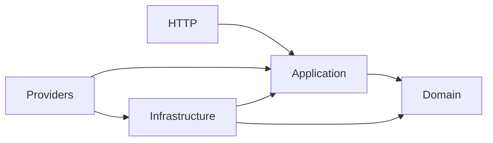

# アーキテクチャ設計

## 1. 位置づけと採用方針

[開発方針](../spec/開発方針.md)を、ディレクトリ・依存関係・処理の流れに具体化する。
本書は今後の実装に適用する基本設計であり、記載したクラスがすでに存在することを意味しない。
機能固有の業務ルール、コンテキスト名、集約、画面・APIは機能概要と詳細設計で決める。

採用するのは、単一のLaravelアプリケーション内で業務の境界を分けるモノリス構成と、更新・参照の責務分離である。
DDDは業務の意味とルールを表現するために用いる。ディレクトリ分割そのものを目的にしない。
更新・参照のクラスと入出力を分けるが、当初は同じDBを使う。独立した参照DBや同期処理は設けない。
採用理由と見直し条件は[初期アーキテクチャの判断記録](../decisions/0001-初期アーキテクチャ.md)に記載する。

### 技術スタックと画面・APIの構成

| 対象 | 採用方針 |
| --- | --- |
| サーバー | PHP 8.5 / Laravel。Docker内で実行 |
| 初期画面 | BladeでHTMLを返す。利用者の操作は当面1ページ内で完結 |
| スタイル | CSS。Tailwindも利用可。具体的な採用は画面設計時に決める |
| ブラウザー処理 | JavaScriptのモジュールと`fetch`でAPI通信・部分的なDOM更新を行う |
| API | 同一Laravelアプリ・同一オリジンのJSONエンドポイントで取得・更新 |
| 業務処理の入口 | HTTP。業務用CLI／Artisanコマンドは現時点で作成しない |

初回アクセスでBladeのページを表示し、利用者の操作に応じてJavaScriptから必要なAPIを呼ぶ。
1ページ構成でも、参照と更新のエンドポイント・Controller・Handlerは目的ごとに分ける。
APIからDomain・Applicationへ進む責務分離は維持する。
Laravelの開発・運用用Artisan（マイグレーションやテスト等）は引き続き使用する。

### ブラウザーとAPIの境界

- Bladeは画面の骨組み・部品・初期設定、JavaScriptはイベント・通信・表示状態、CSSは見た目を担当する。
- JavaScriptには操作性のための検証を置けるが、業務ルールと最終的な入力検証はサーバーで保証する。
- APIのURLはLaravel側で生成してBladeから渡し、JavaScriptにルーティングを重複定義しない。
- 当初の画面用JSONエンドポイントは`routes/web.php`に定義し、Webミドルウェアによるセッション・CSRF保護を適用する。JSONを返すことだけを理由にステートレスAPIへ分離しない。
- `fetch`ではJSON応答を要求し、更新リクエストにはBlade経由で渡したCSRFトークンを付与する。認証の要否は機能設計で決める。
- APIのメソッド、URL、入力、成功・失敗のJSON形式、ステータスコードを機能設計に記載する。取得はGET、状態変更はPOST/PATCH/DELETE等を目的に合わせて使う。
- 通信中・成功・入力エラー・通信失敗の画面状態を定義する。二重送信防止と、古い応答による新しい表示の上書き防止を必要な操作で設計する。
- 入力エラーやセッション期限切れ時も入力内容を保ち、再操作を案内する。結果不明の更新を自動再送しない。
- 生成文やユーザー入力はテキストとして表示し、信頼できないHTMLを直接挿入しない。APIキーや外部AI呼び出しはサーバー側で扱う。

HTML・CSS・JavaScriptの分割単位は画面の責務に合わせる。1ページだからといってBladeにすべてのコードを埋め込まない。
アセットのビルド方法は画面実装時に決める。ViteやTailwindのビルドにNode.jsが必要な場合はDocker側に構築する。現在のDocker環境にはNode.jsを追加していない。

## 2. ディレクトリ構成

既存の開発方針に合わせ、層を上位、業務の文脈をその下に置く。
`<Context>`は用語集で決めた業務の文脈、`<UseCase>`は利用者の目的を表す名前で置き換える。
以下は配置規則であり、必要になるまで空ディレクトリやクラスを作らない。

```text
app/
├── Domain/
│   └── <Context>/
│       ├── Models/<Aggregate>/       # 集約ルート、エンティティ、値オブジェクト
│       ├── Repositories/             # 集約の取得・保存インターフェース
│       ├── Services/                 # 単一のモデルに属さない業務ルール
│       └── Exceptions/               # 業務ルール違反
├── Application/
│   ├── <Context>/
│   │   ├── Writes/<UseCase>/
│   │   │   ├── <UseCase>Input.php    # 更新の入力
│   │   │   ├── <UseCase>Handler.php  # 更新の実行手順
│   │   │   └── <UseCase>Result.php   # 更新結果（必要な場合）
│   │   ├── Queries/<UseCase>/
│   │   │   ├── <UseCase>Input.php    # 検索条件など
│   │   │   ├── <UseCase>Handler.php  # 参照の実行手順・認可の調整
│   │   │   └── <UseCase>Result.php   # 参照用DTO
│   │   └── Ports/                   # QueryService、外部AI、認可等の境界
│   └── Shared/Ports/                # 共通の技術境界（必要時のみ）
├── Infrastructure/
│   ├── <Context>/
│   │   ├── Persistence/Eloquent/
│   │   │   ├── Models/              # 保存専用Eloquentモデル
│   │   │   ├── Repositories/        # ドメインRepositoryの実装
│   │   │   └── Mappers/             # 保存構造とドメインの変換（必要時）
│   │   ├── Queries/                # QueryServiceの実装
│   │   ├── External/               # AI等の外部サービスアダプター
│   │   └── Authorization/          # 認可ポートの実装（必要時）
│   └── Shared/                     # トランザクション等の共通実装
├── Http/
│   ├── Controllers/<Context>/
│   │   ├── Writes/                 # 更新ユースケースへの入口
│   │   ├── Queries/                # 参照APIの入口
│   │   └── PageController.php      # 初期Bladeページの表示
│   ├── Requests/<Context>/         # HTTP形式の検証と入力変換
│   └── Resources/<Context>/        # DTOをHTTPレスポンスに変換（必要時）
├── Models/User.php                 # 既存の認証用モデル。当面維持
└── Providers/                      # インターフェースと実装の結び付け

bootstrap/                          # Laravelの起動・例外処理設定
config/                             # DB・AI等の設定
routes/web.php                      # ページと画面用JSONエンドポイント
resources/
├── views/                          # 1ページのBladeと表示部品
├── js/                             # ページ制御・API通信・DOM更新
└── css/                            # CSS（Tailwindを採用する場合もここ）
database/                          # migrations・factories・seeders
tests/
├── Unit/Domain/<Context>/
├── Unit/Application/<Context>/
└── Feature/
    ├── Http/<Context>/
    └── Infrastructure/<Context>/
docker/                             # PHP・Nginxの設定
compose.yaml
docs/                               # 仕様・設計・判断記録
```

名前空間は既存の`App\`→`app/`のオートロード設定に合わせる。
例：`app/Application/<Context>/Writes/<UseCase>/`は`App\Application\<Context>\Writes\<UseCase>`。
`Writes`はAPI経由の更新ユースケース、`Queries`は参照ユースケースを表す。

### 命名と配置のルール

- ユースケースは`Create…`、`Change…`、`Get…`、`List…`など目的を表す名前にし、原則一つのHandlerが一つの目的を担当する。
- 一つの業務Controllerに更新・一覧・詳細取得を集めず、ユースケース単位のControllerからHandlerを呼ぶ。
- Domainは業務用語で命名し、DBのテーブル名から機械的にモデルを作らない。
- ドメインRepositoryは`…Repository`、実装は`Eloquent…Repository`、参照境界は`…QueryService`など、役割が分かる名前にする。
- 汎用的な`BaseRepository`や何でも入る`CommonService`は先に作らない。共通化には目的と変更理由が同じである根拠を残す。
- DomainをWritesとQueriesに二重化しない。更新で守る業務概念を置き、参照用DTOはApplicationに置く。
- Laravelの生成コマンドが標準配置に作るモデル等は、採用した配置に合わせる。既存ファイルの一括移動は行わない。

## 3. 層の責務と依存関係

| 層 | 依存してよい対象 | 持ち込まないもの |
| --- | --- | --- |
| Domain | PHP標準機能、同じ文脈のドメイン型 | Laravel、Eloquent、HTTP、外部SDK、Application、Infrastructure |
| Application | Domain、Applicationが所有するポート・DTO | Eloquent、DB/Auth等のFacade、HTTP Request/Response、外部SDK |
| Infrastructure | 実装するDomain/Applicationの契約、Laravel、DB、SDK | 利用者の処理手順や業務ルールの代行 |
| HTTPの入口 | Applicationの入力・Handler・結果、Laravel | 直接のSQL、業務ルール、Repository実装の直接呼び出し |
| Providers・起動設定 | 各層の結び付けに必要な型 | 業務判断 |

ApplicationとDomainは通常のPHPクラスとして扱う。DIコンテナから具体実装を取得する処理をHandlerに埋め込まない。
Providersは構成を組み立てる例外的な場所であり、全層を参照できる。
DTOは明示的な型を持ち、原則不変にする。Eloquentモデル・Builder・HTTPオブジェクトを層の外へ返さない。



矢印はソースコード上の依存方向を示す。実行時には、Applicationがインターフェース越しにInfrastructureを呼ぶ。
ドメインRepositoryの契約はDomain、参照・外部連携などユースケースが要求する契約はApplicationに置く。

## 4. 更新系の流れ

1. 入口で形式を検証し、信頼できる認証情報から実行者を特定してInputを作る。
2. Handlerで実行者の権限・利用条件を確認する。対象の状態が必要なら取得後に対象ごとの認可を行う。
3. 必要な更新単位をトランザクションで囲み、Repositoryから集約を取得・再構築する。
4. 集約や値オブジェクトの操作で業務ルールを適用する。不変条件はドメイン内で守る。
5. Repositoryで集約を保存し、必要最小限のResultを返す。
6. 入口でHTTPレスポンス等に変換する。

Repositoryは集約単位とし、テーブルごとのCRUDラッパーを一律に作らない。
永続化からの再構築でも不正なドメイン状態を黙って許容しない。
DBの一意制約・外部キー等はドメインの保証を補完する。競合時の最終的な整合性はDBでも守る。

トランザクション範囲はHandlerが決定する。必要になった時点でApplicationの`TransactionManager`ポートとInfrastructureのLaravel実装を用意する。
ドメインや個々のRepositoryで勝手にコミットしない。複数Repositoryをまとめる場合も同じ接続・トランザクションを使う。
競合・二重実行の可能性がある機能は、一意制約、ロック、バージョン比較、冪等キーのどれで守るか詳細設計に記載する。

## 5. 参照系の流れ

1. 入口で検索条件・ページ数等を検証し、実行者情報とともにInputを作る。
2. Query Handlerが権限と参照可能範囲を確定する。
3. ApplicationのQueryServiceインターフェース越しに必要なデータを取得する。
4. InfrastructureがEloquentまたはQuery Builderで絞り込み、参照用DTOに変換する。
5. Handlerから返したResultを入口で画面・JSON等に変換する。

QueryServiceに所有者・公開範囲などの制約を渡し、取得時に絞り込む。全件取得後の表示時だけで隠す設計にしない。
参照に更新用集約の復元やRepositoryの流用を強制しない。逆に、参照DTOを更新の正当性を保証するモデルとして使わない。
ソート条件、件数上限、ページング、返却項目は詳細設計で定義する。
参照処理は業務状態を変更しない。アクセスログなどの運用上の副作用はこれと区別する。

更新直後にID・処理結果を返すことは許容する。画面全体の再取得が必要なら別の参照ユースケースを呼ぶ。
更新が必要な生成処理や有料AI呼び出しを、単に文字列を返すからという理由で参照系に分類しない。
分類はHTTPメソッドや返り値の有無ではなく、状態・外部副作用と利用目的で判断する。

## 6. 三つのモデルと保存先

| モデル | 配置 | 表すもの |
| --- | --- | --- |
| ドメインモデル | Domain/Models | 業務概念、ルール、不変条件、状態遷移 |
| 参照モデル | Application/Queries内のResult・DTO | 利用者や画面が必要とする情報 |
| 永続化モデル | Infrastructure/Persistence/Eloquent/Models | テーブル、カラム、リレーション |

Mapperは変換が複雑になった場合に切り出す。変換が少量ならRepository内でよく、全モデルへのMapper作成は強制しない。
マイグレーションはLaravel標準の`database/migrations/`に置く。
現状のSQLiteは開発用の初期選択であり、本番DBの決定ではない。本番DBが決まったら、そのDBでも制約・SQL・競合制御のテストを行う。
既存の`app/Models/User.php`は認証用のLaravelアダプターとして当面維持し、Domainに渡さない。認証方式や利用者の業務モデルは機能設計で決める。

## 7. 文脈の境界と外部AI連携

別の文脈の集約、Repository、テーブルへ業務コードから直接アクセスしない。
必要な連携は、呼び出す側のApplicationにポートを定義し、Infrastructureのアダプターから提供側の公開ユースケースを呼ぶ。
公開する入力・出力の意味を文書化し、相手の内部モデルを共有しない。
複数文脈のデータを横断する一覧が必要になった場合は、データの所有者と公開範囲を確認し、参照連携の方法を設計判断に残す。

外部AIの呼び出しが必要な機能では、Applicationに目的に沿ったポートを定義する。
SDKのクラス・レスポンスをApplicationやDomainに漏らさず、アダプターで入出力とエラーを変換する。
プロバイダー、モデル、キー等は`config/`と環境変数で管理し、ドメインの定数やコードに秘密情報を埋め込まない。

外部ネットワーク応答を待つ間、DBの更新トランザクションを保持しない。
呼び出し前後の状態、外部成功後のDB失敗、タイムアウト時の結果不明、再試行による二重課金を機能設計で扱う。
同期・非同期は待ち時間や信頼性の要件から決め、Queueや自動再試行を先行導入しない。
将来Queueが必要になった場合は本書の入口・配置を更新する。Jobは入口としてHandlerを呼び、DBコミット後の投入、再実行時の整合性、結果確認方法を定める。

## 8. 認証・認可・エラー・運用

- 認証はLaravelの入口で行い、ユーザー入力のIDを実行者情報として信用しない。
- 業務操作・参照の認可はApplication経由で保証し、どのAPIから呼んでも省略できないようにする。Laravel Policy等を使う場合は認可ポートの実装側で扱う。
- 業務上の資格・状態条件はDomainで表現し、アクセス権の判断と区別する。
- DomainのエラーにHTTPステータスを持たせない。Applicationで扱う失敗と、入口でのHTTPへの変換を分ける。
- インフラ由来のSQL・SDKエラーは必要に応じてアダプターで意味のある失敗へ変換する。想定外の障害は握り潰さず記録し、利用者には内部情報を返さない。
- 具体的なステータスコード、エラー文言、見つからない対象と権限なしの扱いは機能ごとに定義する。
- ログには処理を追跡できるIDと結果を残す。APIキーやプロンプト本文を無条件に記録しない。保存・ログの保持期間は要件確定時に決める。
- 時刻、ID生成、外部サービスなどテストを不安定にする依存は、必要な箇所で境界を設ける。全PHP関数を一律にインターフェース化しない。

## 9. テストと既存コードへの適用

| テスト | 主な対象 | 実行方針 |
| --- | --- | --- |
| Unit/Domain | 不変条件、状態遷移、値の操作 | Laravel・DBを起動せず検証 |
| Unit/Application | 認可、更新・参照の手順、失敗の扱い | ポートのFake等で検証 |
| Feature/Infrastructure | Repository、QueryService、変換、DB制約 | テスト用DBで検証。外部APIは原則Fake |
| Feature/Http | 入力、認証・認可、レスポンス、主要な受入条件 | Laravel経由で検証 |

画面は初期表示、API結果の部分更新、通信中の表示、入力・通信エラー、二重送信防止をブラウザーで確認する。
更新系はDBへの保存結果と失敗時のロールバック、参照系は表示項目・参照可能範囲・絞り込みを確認する。
`tests/Unit`と`tests/Feature`の既存区分を利用し、実装する機能に応じて配下を追加する。
依存方向の検査を自動化する場合は、導入するツールと実行方法を別途決める。当面はレビューで本書の依存表を確認する。

現在のLaravel初期コードはそのまま残す。機能を実装するときに必要なクラスだけ追加し、関連する既存コードを移行する。
本書の追加に伴うアプリケーションの移動、パッケージ追加、DB変更は行わない。
実行環境の操作は[DOCKER.md](../../DOCKER.md)に従う。

## 10. 実装前に詳細設計で決めること

以下は未決事項であり、本書の配置例から機能要件を推測して確定しない。

| 決めること | 決定する時点 |
| --- | --- |
| 利用者、最初の機能、業務用語、文脈と集約の境界 | 機能概要・用語集・最初の詳細設計 |
| 1ページ内のUI詳細、必要なAPI、認証方式と認可条件、Tailwind・アセットビルドの採否 | 該当する画面・ユースケースの実装前 |
| 生成方式、AI利用の有無、プロバイダー、品質・費用の基準 | 生成機能の実装前 |
| 保存対象、保持期間、トランザクション、競合・冪等性 | 保存を伴う機能の実装前 |
| 同期・非同期、タイムアウト、再試行、障害からの復旧 | 外部連携・長時間処理の実装前 |
| 本番DB、ホスティング、バックアップ、監視 | 本番構成に依存する実装・本番公開前 |

アーキテクチャを変更する場合は、目的と変更理由、影響する層・機能・テストを判断記録に残し、本書と関連する詳細設計を更新する。
