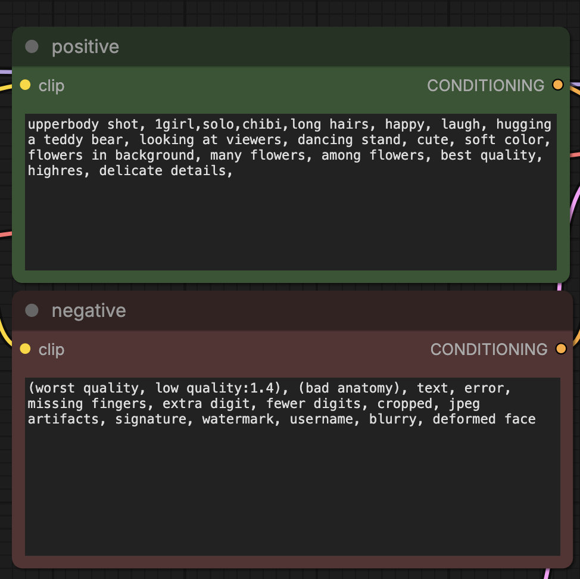

# プロンプト準備画面

- 関連：[機能概要](../spec/機能概要.md)、[F01](features/F01-デフォルトプロンプト.md)、[F02](features/F02-プロンプトの選択と表示.md)、[F03](features/F03-出力の編集とコピー.md)、[F05](features/F05-LoRAの登録と選択.md)、[F06](features/F06-表情と視線の登録と選択.md)、[F07](features/F07-場所と構図と動作の登録と選択.md)、[F08](features/F08-オプション項目の登録と選択.md)、[F09](features/F09-衣装LoRAの登録と複数選択.md)、[F10](features/F10-セクションナビゲーションと選択概要.md)。

## 目的

初めて開いた利用者が、上部で使う項目を選び、下部の結果を画像生成ツールの対応する欄へコピーする流れを理解できるようにする。
出力欄は貼り付け先に外観を寄せ、positive／negativeの対応を見つけやすくする。

## 参考画像



画像では、緑色のpositiveカードが上、赤茶色のnegativeカードが下にあり、各カードに見出しと暗い背景の大きなテキスト欄がある。
左右の接続線は画像生成ツール内の別の処理につながり、画像サイズなどはその接続先で設定される。
本画面で準備する文面は、この画像の各テキスト欄へ利用者が貼り付ける。

## 構成

中央領域は画面上部から「入力」「表示ボタン」「出力」の順に配置する。幅1,200px以上では中央領域の左右に補助メニューを置く。
以下の見出しを基本とする。

```text
入力：使う項目を選ぶ

  positive
    [✓ デフォルト] [編集アイコン]

  negative
    [✓ デフォルト] [編集アイコン]

  （編集時は対象の近くに編集用テキストエリアと保存・キャンセル）

  [プロンプトを表示] [リセット]

出力：画像生成ツールへコピー

  ┌ positive ──────── [コピーアイコン] ┐
  │ 編集可能なテキストエリア          │ 緑系のカード
  └───────────────────────────────┘

  ┌ negative ──────── [コピーアイコン] ┐
  │ 編集可能なテキストエリア          │ 赤茶系のカード
  └───────────────────────────────┘
```

## 広い画面の補助メニュー

- 中央の入力・出力領域は従来のスマートフォン相当の幅を維持する。
- 幅1,200px以上では、中央領域の左外側にセクションナビゲーション、右外側に選択概要を表示する。それ未満では両方を非表示とし、中央領域だけを表示する。
- 両メニューはビューポート上端から余白を取って追従し、内容が画面高を超えた場合はメニュー内を縦スクロールできるようにする。
- 左メニューにはデフォルト、人物・キャラクターLoRA、衣装LoRA、各オプションブロックを画面の順に表示する。項目を選ぶと対応する入力セクションへ滑らかに移動する。
- 右メニューには選択があるセクションだけを表示し、登録名を画面の順に並べる。LoRAには今回の強度、所属するトリガーや服装には登録名を表示する。
- オプションブロックの追加、名前変更、並べ替え、項目移動と選択変更は、ページ再読み込みなしで両メニューへ反映する。

## 入力欄

- 中央の操作領域は常にスマートフォン相当の幅に収め、positive、negativeの順で縦に並べる。
- 「入力」と、ここで行う操作を表す見出しを常時表示する。
- positive／negativeを分け、各側にカテゴリ見出しを置き、その下にボタンを並べる。初期のカテゴリはデフォルトのみとする。
- カテゴリ内のボタンは横に並べ、幅が足りない場合は折り返す。将来のカテゴリ名や項目は各機能の設計で決める。
- デフォルトは各側に一つの選択ボタンで全文を扱い、ページロード時は選択状態とする。
- 保存されているデフォルト文面は通常時には展開せず、編集操作でテキストエリアに表示する。
- 選択状態は色に加えてチェック表示などでも区別する。編集は意味を判別できるアイコンボタンで選択ボタンの近くに置き、選択と編集を別の操作として示す。
- 編集用テキストエリアには「positiveのデフォルトを編集」など対象を明示し、保存する文面を編集していることが分かるようにする。
- 単一選択リストで候補を選んだ場合は、入力を上から順に進められるよう、直後の入力セクションの先頭へ滑らかにスクロールする。選択解除や検索による表示更新ではスクロールしない。

カテゴリはここでは画面上の分類を指す。保存方式や業務モデルは、そのカテゴリの機能設計で定める。

### LoRA・トリガー・服装

- LoRAカテゴリには検索欄と、複数行が見えてスクロールできる単一選択リストを置く。各候補には登録名とファイル名を表示する。
- LoRA強度は0から1まで0.1刻みで選べるようにし、選択したLoRAの推奨強度を初期値とする。
- LoRAを選ぶと、そのLoRAに属するトリガー候補をトリガーセクションへ表示する。トリガーは一つだけ選べる。
- 服装カテゴリには選択中LoRAに属する服装だけを表示し、未選択または一つを選べる。
- 初期状態はLoRA、トリガー、服装をすべて未選択とする。LoRAを選択した場合は、そのLoRAに属する先頭トリガーを自動選択する。服装は自動選択しない。
- LoRA、トリガー、服装の各カテゴリに管理操作を置き、追加・編集・削除用のフォームを通常の選択操作と区別して開く。
- 削除確認では対象の登録名と関連データへの影響を表示する。

### 衣装LoRA

- 既存のLoRA・トリガー・服装の後ろに、独立した衣装LoRAセクションを置く。
- 登録名またはファイル名の検索欄と、複数選択できる縦スクロール可能なカード一覧を置く。
- 各カードには登録名、ファイル名、選択状態を表示する。選択中のカードは展開し、その衣装LoRA専用の強度欄と所属トリガーの単一選択欄を表示する。
- 選択中のカードは検索条件に一致しない場合も一覧上部に残し、個別の強度とトリガーを見失わないようにする。
- 衣装LoRAとトリガーの追加・編集・削除は、対象カードとの関係が分かる管理操作から中央のモーダルを開いて行う。
- ページロード時はすべて未選択とする。選択時は推奨強度と先頭トリガーを設定し、トリガーがない場合は未選択のままとする。

### 名前付きオプションブロック

- 表情、視線、場所、構図、動作を含む汎用候補は、利用者が名前を付けたオプションブロックとして同じ領域に並べる。
- 各ブロックの見出しに名前、単一・複数の選択方式、ドラッグハンドル、編集操作を表示する。
- 項目は登録名だけのバッジとして表示する。`single`では最大一つ、`multiple`では複数を選べる。
- 各ブロックに登録名の検索欄を置き、選択中項目を残しながらブラウザー内で候補を絞り込めるようにする。
- ブロックはドラッグハンドルで並べ替える。項目は専用ハンドルから同一ブロック内で並べ替え、別ブロックへ移動できる。
- ドラッグ中は移動対象と挿入先を強調し、ドロップ可能なブロックを示す。保存失敗時は操作前の位置へ戻す。
- 管理メニューに上下移動を置き、項目には移動先ブロックを選ぶ操作も置く。ドラッグできない環境でも同じ変更を行えるようにする。
- 候補領域は複数行分の高さを持ち、超過時は縦スクロールする。選択状態はチェック表示と`aria-pressed`でも示す。
- 追加・編集は中央のモーダルで行い、モーダル外のクリックまたはキャンセル操作で閉じられるようにする。

## 出力欄

- 参考画像と同じくpositiveを上、negativeを下に置く。
- positiveは緑系、negativeは赤茶系のカードとし、濃い見出し部分と暗い背景の広いテキストエリアで参考画像との対応を示す。
- 見出しは貼り付け先と同じ`positive`／`negative`を明示する。色だけに識別を頼らず、文字と配置でも区別する。
- 各カード内の見出し付近に、意味を判別できるコピーアイコンのボタンを置き、対象の文面と操作を近づける。
- テキストエリアは読みやすい文字サイズ・コントラストを確保し、長い文面を折り返して表示する。必要に応じて縦方向に広げたりスクロールしたりして編集できるようにする。
- 左右の接続線や`clip`／`CONDITIONING`は参考画像での処理の接続を表す。外観を寄せる要素は、貼り付け先の識別に役立つカード構成・見出し・配色・テキスト欄とする。
- 出力の直接編集は保存済みデフォルトを変更しない。コピーは操作時点の各テキストエリアの値を対象とする。
- コピー成功時はpositive／negativeの配色と区別した中立色のトースト通知を表示し、失敗時は対象欄の近くで手動コピーを案内する。
- 「プロンプトを表示」を実行したら、生成した文面をすぐ確認できるよう出力欄の先頭へスクロールする。
- 「プロンプトを表示」の近くに副操作として「リセット」を置く。実行時は出力欄と全カテゴリの選択を空にし、LoRA強度と検索条件を初期化してからLoRAセクションの先頭へスクロールする。登録済みの文面や候補は削除しない。
- 出力文字列のセクション間には空行を一つ入れる。各セクションの末尾カンマを保持し、文面の区切りを視覚的にも示す。詳細はF02に従う。
- positiveは、デフォルト、人物・キャラクターLoRAタグ、そのトリガー、衣装LoRAタグ、衣装LoRAトリガー、服装、保存された表示順の各オプションブロックの順に、選択されている空でないセクションを並べる。

狭い画面でもpositive→negativeの順序とカテゴリのまとまりを保つ。ボタンとテキストエリアはキーボード操作でき、フォーカス位置・選択状態・コピー結果が分かるようにする。

## 画面の受入条件

| 関連要件 | 確認する場面 | 期待結果 |
| --- | --- | --- |
| F02-R05 | 初めて画面を開く | 上部に入力の見出しがあり、カテゴリ内のボタンが選択対象だと分かる |
| F02-R01・R02 | 初期表示を確認する | positive／negativeのデフォルトボタンが各一つあり、両方とも選択中と分かる |
| F03-R06 | 出力欄を参考画像と見比べる | 上の緑系positive、下の赤茶系negativeがそれぞれ貼り付け先に対応している |
| F03-R01・R02 | 文面を調整してコピーする | 編集欄とその側のコピーボタンが同じカード内にあり、調整後の文面をコピーできる |
| F02-R05・F03-R06 | 幅を狭めて確認する | カテゴリ見出し・選択ボタン・出力カードの対応と順序が保たれる |
| F05-R02・F05-R05・F05-R07 | 単一選択リストから候補を選ぶ | 選択状態を反映した後、直後の入力セクションの先頭へスクロールする |
| F02-R07 | 選択と出力がある状態でリセットする | 今回の選択と出力が初期化され、LoRAセクションへスクロールする |
| F08-R01〜R04 | 名前と選択方式を指定してブロックを追加し項目を登録する | 再読み込み後も設定が残り、方式に合う数だけ選択できる |
| F08-R05・R06・R09 | ブロックまたは項目をドラッグまたは管理メニューで移動する | 保存後も順序・所属が残り、出力順へ反映される |
| F09-R03・R04・R06 | 複数の衣装LoRAを選ぶ | 各カード内で個別の強度と所属トリガーを選べる |

画面の受入条件は、HTTPテストとブラウザー操作で確認する。
